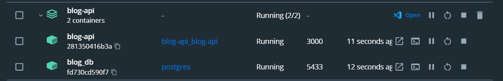

## Description

It's just example API on NestJs using Postgresql, Docker, Typeorm, Swagger.

## Installation

```bash
$ npm install
```

## Environment

Rename .env-sample to .env and fill all variables.

## Running the app

```bash
# development
$ npm run docker:dev
```

## Typeorm Migration

After app has been started open blog-api in console and run command bellow


```bash
# run migrations using typeorm cli
$ npm run migration:run
```

## Additional information
Use this commands inside Docker container
```bash
# You can generate new migration files from entities using command bellow
$ npm run migration:generate src/database/migrations/MigrationName

# You can revert your migration
$ npm run migration:revert
```
